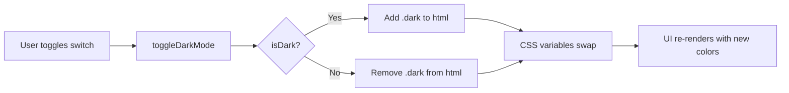

# HANDI Dark Theme Customization Guide

> This guide documents how the HANDI dark theme system works and how to customize it.

## Architecture

The dark theme uses **CSS custom properties** (variables) toggled by a `dark` class on `<html>`.

### Files

| File                       | Purpose                                                                                                                 |
| -------------------------- | ----------------------------------------------------------------------------------------------------------------------- |
| `context/ThemeContext.tsx` | React context providing `isDark` and `toggleDarkMode()`. Persists preference in `localStorage` under `handi_dark_mode`. |
| `app/globals.css`          | CSS variables for both `:root` (light) and `:root.dark` (dark) themes, plus Tailwind utility overrides.                 |

## How It Works



1. User taps the **Dark Mode** toggle in ProfileTab
2. `toggleDarkMode()` toggles `isDark` state and adds/removes the `dark` class on `document.documentElement`
3. CSS variables defined under `:root.dark` take effect automatically
4. The preference is saved to `localStorage` and restored on page load

## Color Token Reference

| Token                   | Light     | Dark      | Usage                         |
| ----------------------- | --------- | --------- | ----------------------------- |
| `--color-primary`       | `#245e37` | `#2d7a46` | Buttons, links, brand accents |
| `--color-primary-dark`  | `#1d4b30` | `#245e37` | Hover states                  |
| `--color-primary-light` | `#e1f2e8` | `#1a3a28` | Light accent backgrounds      |
| `--color-secondary`     | `#9db541` | `#7a9132` | Secondary accents             |
| `--color-background`    | `#f4f5f7` | `#0f1117` | Page background               |
| `--color-surface`       | `#ffffff` | `#1a1d27` | Cards, panels                 |
| `--color-text`          | `#1f2937` | `#e5e7eb` | Primary text                  |
| `--color-muted`         | `#6b7280` | `#9ca3af` | Secondary text                |
| `--color-border`        | `#e5e7eb` | `#2d3040` | Borders, dividers             |

## How to Customize Colors

### Changing the Primary Color

Edit **both** `:root` and `:root.dark` blocks in `globals.css`:

```css
:root {
  --color-primary: #your-light-color;
  --color-primary-dark: #your-darker-shade;
  --color-primary-light: #your-lighter-shade;
}

:root.dark {
  --color-primary: #your-dark-mode-variant;
  --color-primary-dark: #your-dark-darker-shade;
  --color-primary-light: #your-dark-lighter-shade;
}
```

> [!TIP]
> Use an HSL color picker to create harmonious dark variants: keep the same hue, slightly increase saturation, and lower lightness by 10-15%.

### Adding a New Color Token

1. Define in `:root` and `:root.dark` in `globals.css`
2. Register it in the `@theme inline` block for Tailwind:

```css
@theme inline {
  --color-my-new-token: var(--color-my-new-token);
}
```

3. Use in components: `bg-(--color-my-new-token)` or `text-(--color-my-new-token)`

## Tailwind Utility Overrides

The CSS uses `!important` overrides for common Tailwind classes in dark mode:

| Selector                | Light Value   | Dark Override                    |
| ----------------------- | ------------- | -------------------------------- |
| `.bg-white`             | `#fff`        | `var(--color-surface)` (#1a1d27) |
| `.bg-gray-50`           | `#f9fafb`     | `#151821`                        |
| `.bg-gray-100`          | `#f3f4f6`     | `#1a1d27`                        |
| `.text-gray-900`        | `#111827`     | `#f3f4f6`                        |
| `.text-gray-600`        | `#4b5563`     | `#9ca3af`                        |
| `input/textarea/select` | white bg      | `#1a1d27` bg                     |
| `.shadow-sm/md/xl`      | light shadows | darker rgba(0,0,0,...)           |

## Best Practices

1. **Use CSS variables** (`bg-(--color-primary)`) instead of hardcoded colors in components
2. **Use standard Tailwind grays** (`bg-white`, `bg-gray-50`, `text-gray-900`) — they're already overridden for dark mode
3. **Avoid inline `style={{ color: ... }}`** — these won't respond to dark mode
4. **Test both modes** when adding new UI elements
5. **Use the `isDark` flag** from `useTheme()` only for conditional logic, not for styling
